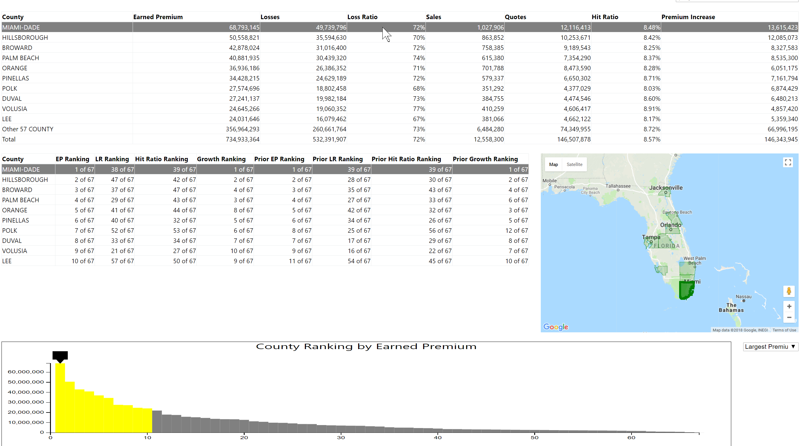

# Monthly Report on Business seqments by Location

[Link](https://htmlpreview.github.io/?https://github.com/jjburke3/monthly_summary_page/blob/master/pricing_meeting.html)

This report was created to display key performance metrics on a monthly basis.  The data was created using a SQL procedure, and stored in tables that this report pulled directly from.  This version has been changed to pull data from csv files

There are 4 parts to the report.  Each one show the top results (default is top 10) sorted by metric selected (default is highest earned premium)

The top part is a listing of each of the key metrics that go into the report for each grouping

The next table is each grouping, and where it ranks for each metric out of all groupings

To the right of that is a map showing the location of each grouping

The bottom part of the report is a bar chart showing the distribution of all groupings by one metric, with the top results selected highlighted in yellow

If you scroll over either table or map, that grouping will be higlighted in each visual

## Built With

* [d3.js](https://d3js.org/) - Javascript Library for Manipulating Data
* [Bootstrap](https://getbootstrap.com/) - Frontend Webframe Work
* [Google Maps API](https://developers.google.com/maps/) - API for drawing google maps
* [jQuery](https://jquery.com/) - Javascript Library for simiplfying javascript commands
* [tablesorter](http://tablesorter.com/docs/) - jQuery pluggin for table formatting

